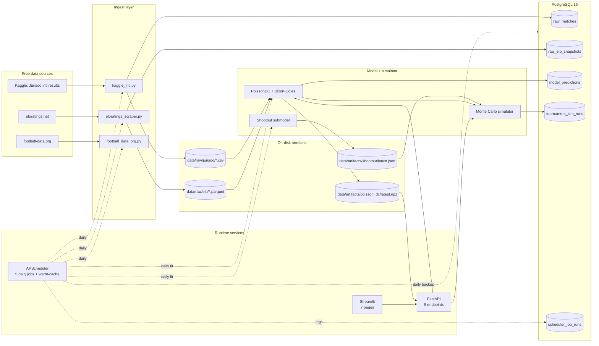

# Architecture

One Python repo. Three runtime processes (API, dashboard, scheduler) talk to one
PostgreSQL database. All data lives on disk or in Postgres; nothing in-process is
load-bearing for restart safety.

## Stage 1 (current, as-built)



### Process responsibilities

| Service | Module | Purpose | Restart safety |
|---|---|---|---|
| FastAPI | `src/wc2026/api/main.py` | Serves prediction + tournament endpoints; loads the latest PoissonDC artefact (or fits in lifespan if missing) | Stateless — reloads on restart |
| Streamlit | `dashboard/streamlit_app.py` | Thin client over the API; cached via `@st.cache_data` (TTL 5–10 min) | Stateless — no DB writes |
| Scheduler | `src/wc2026/scheduler/jobs.py` | Five daily jobs (`db_backup`, `kaggle_intl_refresh`, `eloratings_refresh`, `football_data_org_refresh`, `model_fit`) plus an hourly tournament-window warm-cache; logs each run to `scheduler_job_runs` | Re-registers cron triggers on startup; missed runs are skipped (no catch-up) |

### API endpoints (9)

| Path | Returns |
|---|---|
| `GET /health` | Model + fixtures + Elo snapshot freshness |
| `GET /api/v1/matches` | Filtered fixture list (by date / group) |
| `GET /api/v1/matches/{id}` | One fixture + prediction (full 11×11 score matrix) |
| `GET /api/v1/predictions/{home}/{away}` | 1X2 + xG + top scorelines + score matrix |
| `GET /api/v1/teams/{team}/recent` | Last-n matches per team |
| `GET /api/v1/h2h/{a}/{b}` | Head-to-head history |
| `GET /api/v1/tournament/standings` | 12-group MC probabilities + top-10 champion table |
| `GET /api/v1/tournament/bracket` | One sampled 31-match knockout realisation |
| `GET /api/v1/_ops/scheduler-status` | Latest run per scheduler job (status, error text) |

### Dashboard pages (7)

`Today`, `Match Detail`, `Groups`, `Bracket Realisation`, `Track Record`, `About`, `Operator`.

### Data flow guarantees

- **Ingest is idempotent.** Re-running `download_kaggle_intl.py` overwrites the CSV; `scrape_eloratings.py` writes a fresh dated Parquet. Postgres upserts use `ON CONFLICT DO NOTHING`/`DO UPDATE`. No duplicate rows.
- **Model fit is deterministic.** Same input matches + same weights + same `ref_date` → same parameters (scipy `L-BFGS-B`, no random seed).
- **Monte Carlo is seeded.** Same seed + same model → identical tournament. Cached in the API by `(n_sims, seed)`.
- **No live polling.** Dashboard reads cached predictions; no SSE, no WebSocket, no 60-second loops. Update cadence is whatever the scheduler runs. (Stage 2 Phase 6 changes this.)

## Stage 2 (planned)

The Stage 2 roadmap revives every blueprint item that was deferred in Stage 1. Phases run in dependency order; each ends at a hindcast or smoke-test gate. See [`/Users/nico/.claude/plans/extensively-review-the-given-resilient-anchor.md`](/Users/nico/.claude/plans/extensively-review-the-given-resilient-anchor.md) for the full plan; the table in [`README.md`](../README.md#stage-2-roadmap) summarises the 11 phases.

```mermaid
flowchart LR
    subgraph SRC2[Stage 2 sources]
        TS[TheSportsDB]
        OF[openfootball]
        WP[Wikipedia/Wikidata]
        SB[StatsBomb open]
        FB[FBref]
        FDC[football-data.co.uk]
    end

    subgraph ING2[Stage 2 ingest]
        ITS[thesportsdb.py]
        IOF[openfootball.py]
        IWP[wikipedia.py]
        ISB[statsbomb_open.py]
        IFB[fbref.py]
        IFDC[football_data_co_uk.py]
        ILV[live_events.py]
    end

    subgraph FEAT2[Stage 2 features]
        XGM[xg_shot_model.py]
        XGF[xg_form.py]
        REST[rest_days.py]
        BMF[build_match_features.py]
    end

    subgraph DB2[New tables]
        TA[(raw_team_assets)]
        SQ[(raw_squads)]
        FR[(raw_fifa_rankings)]
        XGE[(raw_xg_events)]
        MF[(features_match_features)]
        LE[(raw_live_events)]
    end

    subgraph ML2[Stage 2 models]
        XGB[xgb_classifier.py]
        SHAP[shap_explain.py]
        BL[blend.py]
        LWP[live_win_prob.py]
    end

    subgraph API2[New endpoints]
        EXP[/api/v1/explain/&#123;id&#125;/]
        SSE[/api/v1/live/&#123;id&#125;/sse]
        COND[/api/v1/tournament/bracket/conditional]
    end

    subgraph UI2[New dashboard]
        TP[Team Profile]
        MAP[PyDeck map]
        BSIM[Interactive bracket]
        SP[SHAP panel on Match Detail]
        LWPC[Live win-prob chart]
    end

    subgraph OPS2[Stage 2 ops]
        FLY[Fly.io deploy]
        SEN[Sentry SDK]
        S3[pg_dump → S3/R2]
    end

    SRC2 --> ING2
    ITS --> TA
    IOF --> DB2
    IWP --> SQ & FR
    ISB --> XGE
    IFB --> XGE
    XGE --> XGM --> XGF --> MF
    REST --> MF
    BMF --> MF
    MF --> XGB --> SHAP & BL
    BL --> API2
    SHAP --> EXP
    ILV --> LE --> LWP --> SSE
    XGB --> COND
    API2 --> UI2
    OPS2 --> SVC
    SVC[Stage 1 runtime services]
```

## What is intentionally not here (Stage 2 honest scope)

Items that the Stage 2 plan explicitly leaves out:

- **Transfermarkt squad market value** — fragile to scrape, legal grey area, marginal feature gain. Squad age from Wikipedia suffices.
- **FIFA.com unofficial JSON** — terms prohibit redistribution; openfootball + football-data.org cover the fixture/group needs.
- **Paid data feeds** (Opta, Sportradar, Enetpulse, Wyscout, paid StatsBomb) — free corpus is sufficient for tournament-level prediction.
- **Bidirectional WebSockets** — SSE is one-way; live updates are server → client only.
- **Prometheus + Grafana stack** — Sentry + the `/health` and `/api/v1/_ops/scheduler-status` endpoints cover Stage 2 needs.
