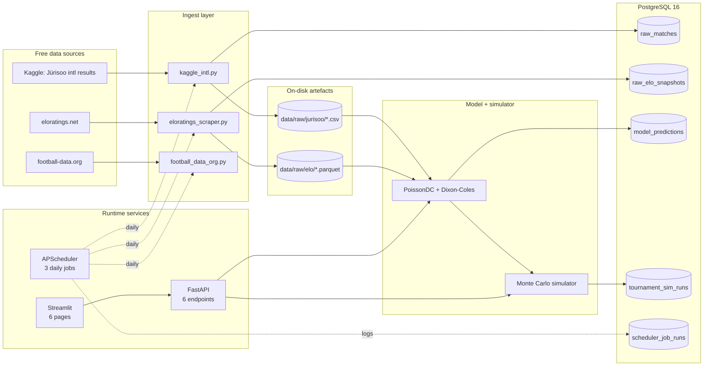

# Architecture

One Python repo. Three runtime processes (API, dashboard, scheduler) talk to one
PostgreSQL database. All data lives on disk or in Postgres; nothing in-process is
load-bearing for restart safety.

## Process responsibilities

| Service | Module | Purpose | Restart safety |
|---|---|---|---|
| FastAPI | `src/wc2026/api/main.py` | Serves prediction + tournament endpoints; fits a PoissonDC model in the lifespan handler at startup | Stateless — re-fits on restart |
| Streamlit | `dashboard/streamlit_app.py` | Thin client over the API; cached via `@st.cache_data` (TTL 5 min) | Stateless — no DB writes |
| Scheduler | `src/wc2026/scheduler/jobs.py` | Three daily ingest jobs (04:00/04:15/04:30 UTC); logs runs to `scheduler_job_runs` | Re-registers cron triggers on startup; missed runs are simply skipped (no catch-up) |

## Data flow guarantees

- **Ingest is idempotent.** Re-running `download_kaggle_intl.py` overwrites the CSV; `scrape_eloratings.py` writes a fresh dated Parquet. No `INSERT` duplicates.
- **Model fit is deterministic.** Same input matches + same weights + same ref_date → same parameters (scipy.optimize with fixed seed-less L-BFGS-B).
- **Monte Carlo is seeded.** Same seed + same model → identical tournament. Cached in the API by `(n_sims, seed)`.
- **No live polling.** Dashboard reads cached predictions; no SSE, no WebSocket, no 60-second loops. Update cadence is whatever the scheduler runs.

## What is intentionally NOT here

See the "Out of scope" section in [README.md](../README.md) and the prescriptive review at `/Users/nico/.claude/plans/extensively-review-and-understand-iterative-fern.md`. Short list: no XGBoost ensemble, no xG features, no SHAP, no in-match win probability, no interactive bracket simulator, no Team Profile page, no Sentry, no PyDeck map.
